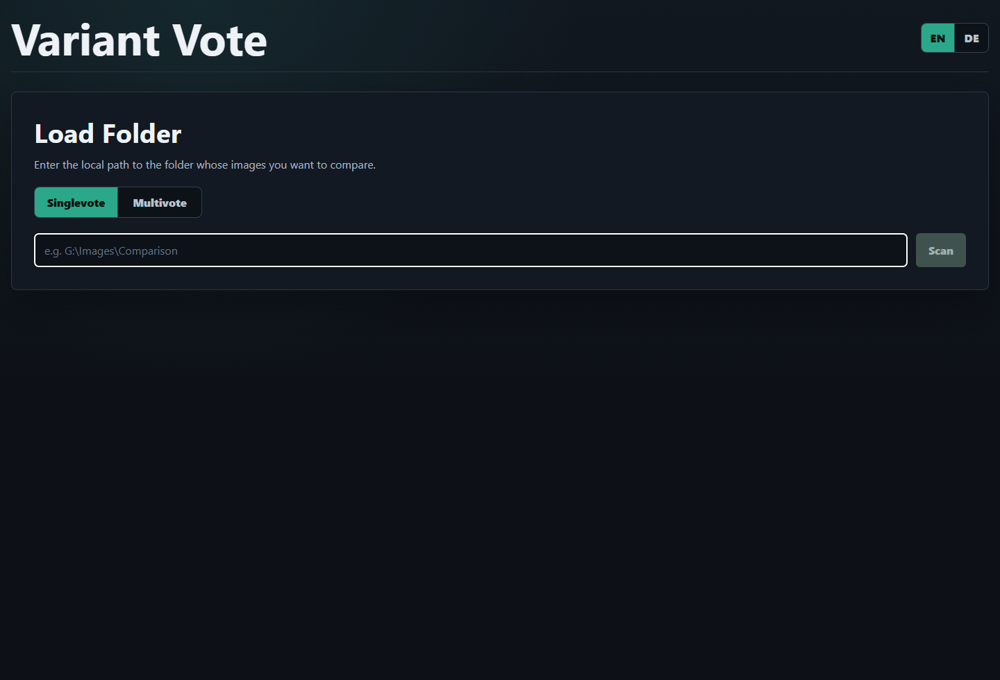
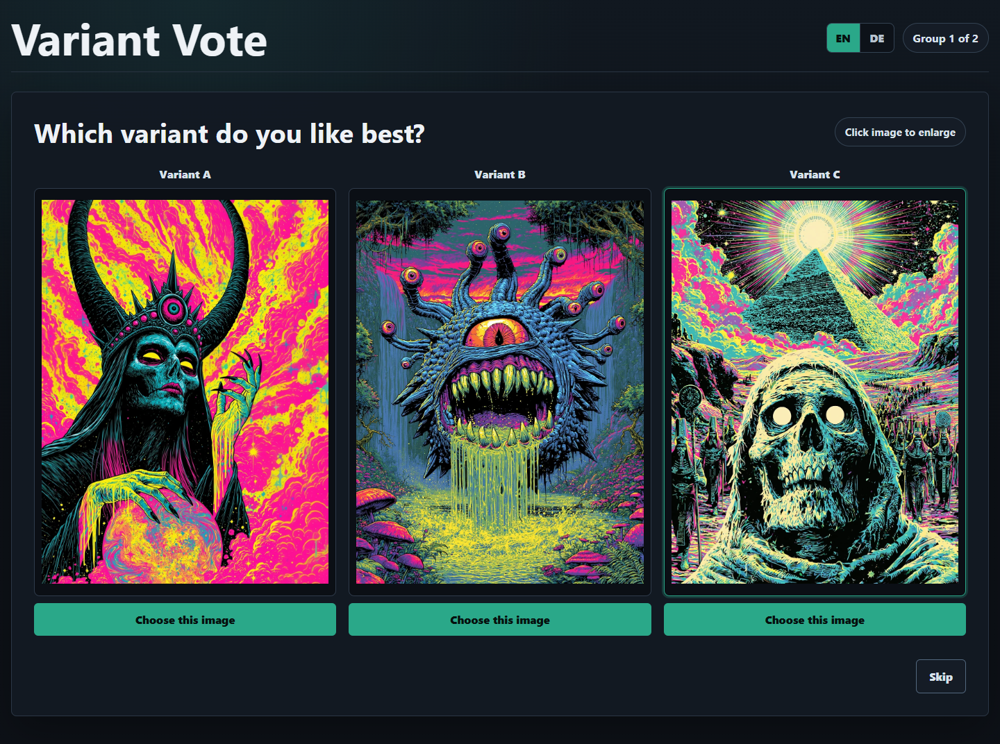
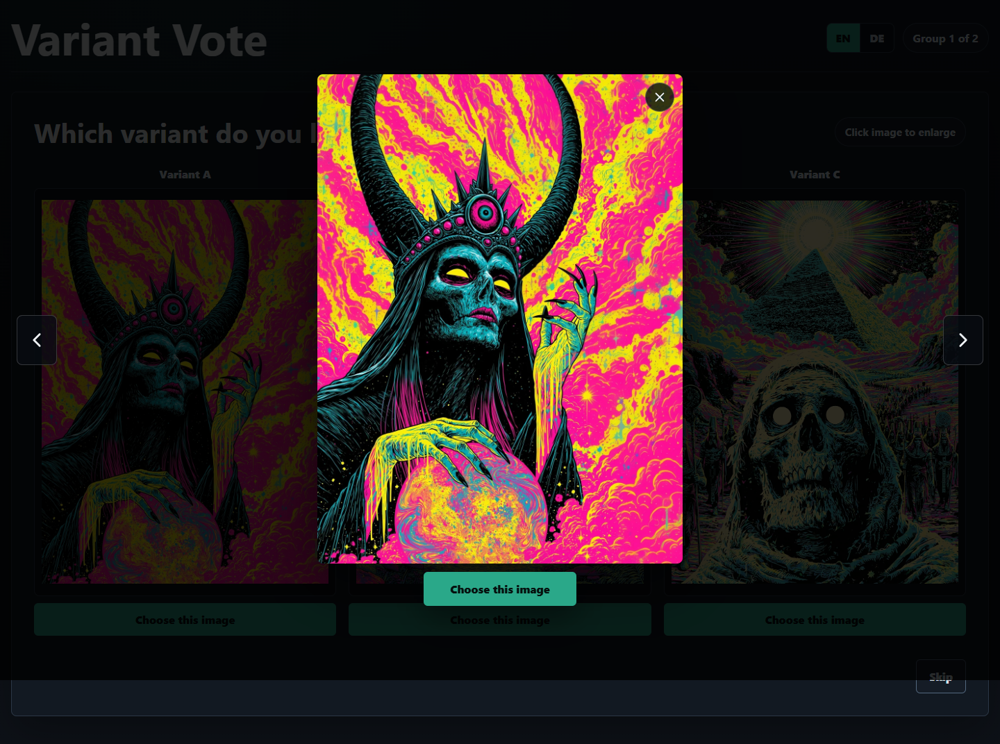
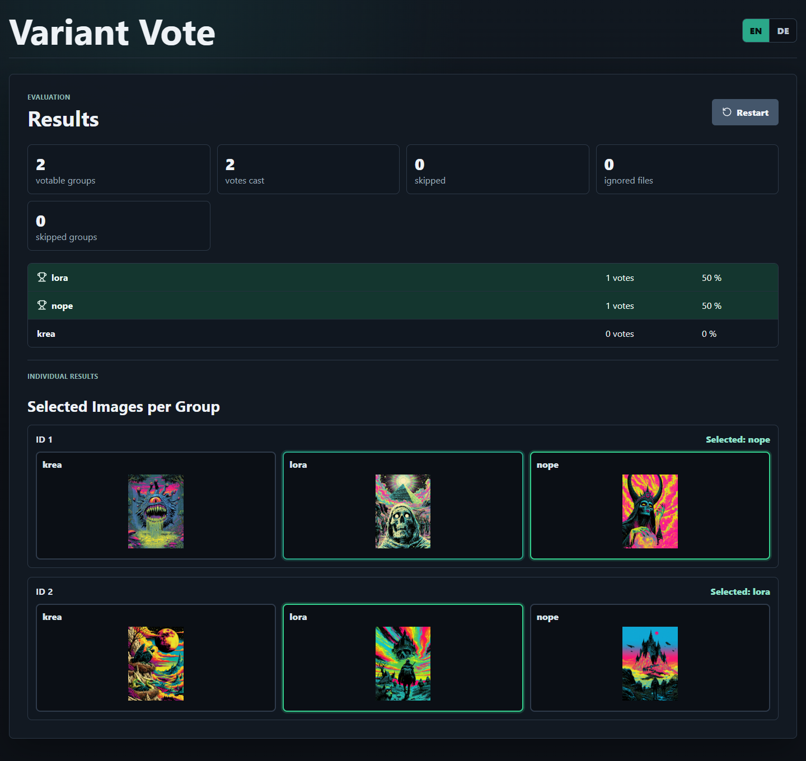

# Variant Vote

Variant Vote is a local web app for blind-comparing image variants. It scans a folder, groups images by ID, shuffles the visible order, and lets you vote for the best variant without showing the real category during voting.

The app runs locally on your machine. Images are not uploaded anywhere.

## Screenshots

### Folder Setup



### Blind Voting



### Enlarged Image View



### Results



## Features

- Local folder scanning
- Blind voting for image variants
- Singlevote and Multivote modes
- Skip option for unclear groups
- Randomized image order per group
- Image lightbox with previous/next navigation
- Optional `.txt` captions shown with matching images
- Result summary by category
- Per-group visual result review with selected images highlighted
- English default UI with German language option
- Dark mode interface

## Filename Format

Images must follow this pattern:

```text
category_id.extension
```

Examples:

```text
both_00001_.png
tenhance_00001_.png
both_00002_.png
tenhance_00002_.png
```

Rules:

- Images with the same `id` are compared together.
- The category is everything before the last underscore.
- The ID is read from the part after the last underscore.
- A trailing underscore before the file extension is allowed.
- Categories may contain underscores.

Supported image formats:

- `.png`
- `.jpg`
- `.jpeg`
- `.webp`

## Optional Text Captions

If a `.txt` file with the same base name as an image exists, its text is displayed with that image.

Example:

```text
both_00001_.png
both_00001_.txt
```

If all images in a voting group have the same caption text, Variant Vote shows it once in a shared full-width box. If captions differ, each image shows its own caption.

## Installation

Install [Node.js](https://nodejs.org/) first. Then install dependencies:

```bash
npm install
```

## Start the App

On Windows, double-click:

```text
start.bat
```

Or start it manually:

```bash
npm run dev
```

Then open:

```text
http://127.0.0.1:5173/
```

## How to Use

1. Start Variant Vote.
2. Choose `Singlevote` or `Multivote`.
3. Enter the local folder path containing your images.
4. Click `Scan`.
5. Vote through each image group.
6. Use `Skip` if you do not want to vote for a group.
7. Review the final results.

In `Singlevote`, selecting one image immediately saves the vote and moves to the next group.

In `Multivote`, you can select multiple images, remove selections, and then click `Save selection`.

## Result View

The result page shows:

- votes per category
- percentages
- skipped groups
- ignored files
- skipped single-image groups
- all categories, including categories with zero votes
- all winners in case of ties
- per-group visual review with selected images highlighted

## Development Commands

Run tests:

```bash
npm test
```

Build the frontend:

```bash
npm run build
```

Start frontend and backend in development mode:

```bash
npm run dev
```

## Privacy

Variant Vote is designed for local use only.

- No image upload
- No external processing
- No user accounts
- No online hosting required

The backend only reads files from the folder path you provide.
